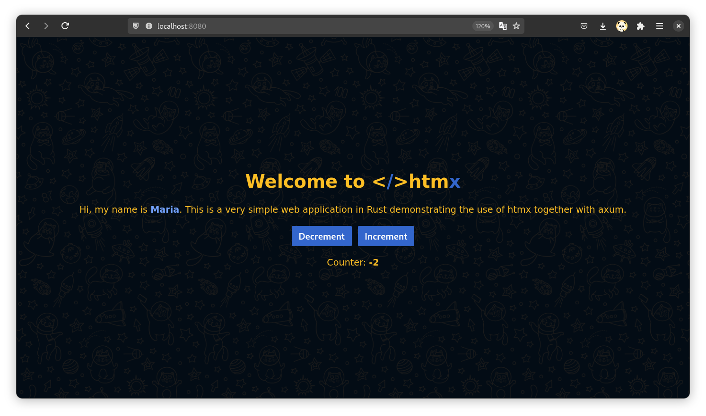

# Htmx Example Web Application



This is a simple web application built with [Rust](https://www.rust-lang.org/), utilizing the following technologies:

- **Axum**: For handling HTTP requests and routing.
- **Rinja**: Template rendering with integration for Axum.
- **htmx**: For dynamic, server-side updates without a frontend framework.
- **Tokio**: Asynchronous runtime for the Rust ecosystem.

## Features

- **Increment/Decrement Counter**: Adjust the counter dynamically with real-time updates.
- **Server-Side Rendering**: No need for complex JavaScript frameworks—htmx handles dynamic updates seamlessly.
- **Graceful Shutdown**: The server can be stopped without interrupting in-progress requests.

## How to Run the Project

### Prerequisites

- **Clode repository**

  ```bash
  git clone  https://github.com/RustPanda/htmx-example.git
  ```
- **Run web application**

  ```bash
  cargo run --release
  ```
- **Go to address http://localhost:8080 in your favorite browser**
